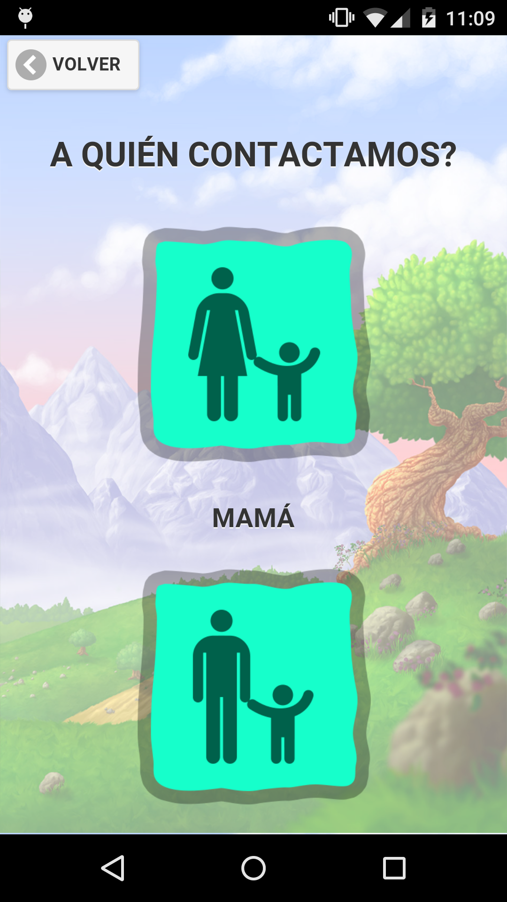

# EnApuros

`EnApuros` es un proyecto que surge a partir de la necesidad de pacientes pre-adolescentes y adolescentes, con diagnóstico de Trastorno del Espectro Autista (TEA), de optimizar la resolución de situaciones adversas donde su autonomía se ve perjudicada por estados emocionales estresantes, amenazantes o que provoca altos niveles de ansiedad.
Tiene como objetivo principal mejorar la comunicación, la expresión, el pedido de ayuda y desarrollo de autonomía mediante dispositivos móviles.

### Equipo

* Natalia Elizabeth Nissen
* María Cecilia Pintos
* Silvana Ghigo
* María Emilia Torino
* Albertina Durante
* Alexis Ferreyra
* Sebastian Piai

## Funcionalidad
Al ingresar a la aplicacion, `EnApuros` presenta la siguiente pantalla de inicio: 

Al hacer "click" en comenzar, el paciente será direccionado a través de una serie de pantallas que le permitirán explicar la situación que esta atravesando. Podrá elegir entre una serie de estados, lugares, situaciones y finalmente podrá elegir a quién contactar para comunicarle lo sucedido. Cada elección se lleva a cabo a través de un simple click entre ventanas, de acuerdo con la siguiente secuencia:

Si bien el objetivo de la aplicación es proveer diferentes canales de comunicación entre el paciente y su contacto elegido (padre, madre, tutor, etc), la versión actual de `EnApuros` sólo permite enviar mensajes de texto (SMS). En versiones posteriores, se desarrollará la funcionalidad completa. 

Esta aplicación pretende además proporcionar un momento de distención tras la notificación de la situación adversa, para reducir los niveles de ansiedad o stress que la misma haya provocado en el paciente. Para ello, `EnApuros` brinda la posibilidad de reproducir un video o una cancion favorita del paciente como paso final en el uso.

### Configuración segura

Si bien `EnApuros` provee situaciones, lugares y contactos predefinidos, es posible personalizarlos a traves de una pantalla de configuracion:

La primera vez que se accede a esta pantalla, por seguridad, la aplicacion solicitará una contraseña que será requeridad posteriormente cada vez que se ingrese a la misma:

Esta contraseña, también puede ser modificada, desde la pantalla principal de configuraciones.

## Limitaciones
* Esta versión incial de la aplicación no posee aún ciertos estándares de calidad, como por ejemplo: validaciones de tipos de datos (formato de números telefónicos, emails, requerimientos mínimos de formatos de contraseña, entre otros).
* La única forma de comunicación soportada actualmente es mensaje de texto.
* El video de relajación aún no se puede personalizar.
* La pantalla de selección del método de comunicación es provisional. La idea es que por defecto cada contacto elegido ya tenga configurado el método de comunicación deseado.
* Algunos métodos de navegacion deseables, no estan presentes (ej: ir al inicio de la aplicacion, salir, etc).

